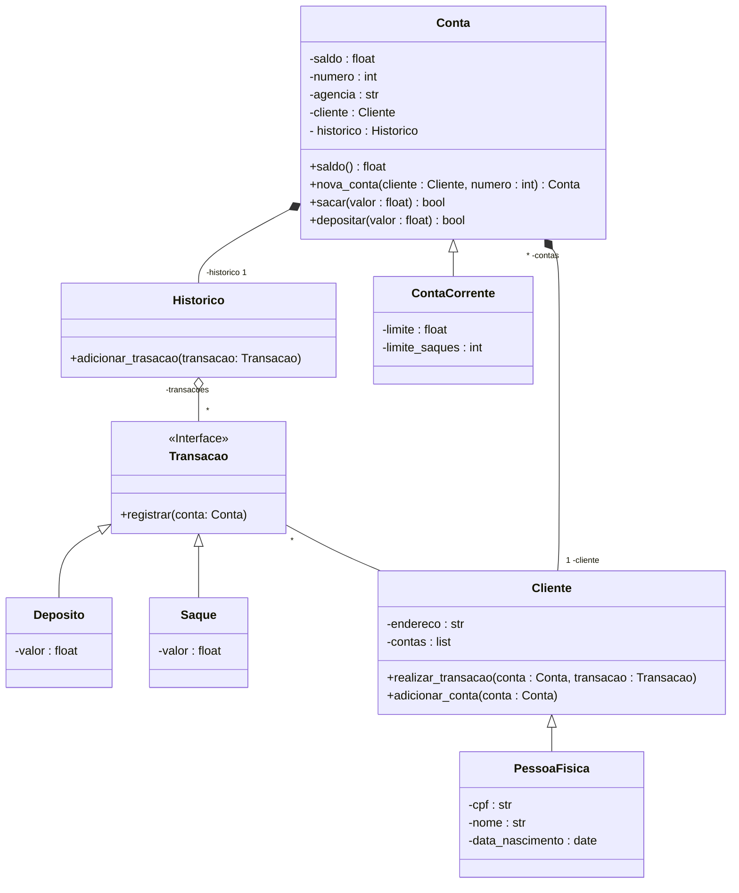

<h1>
    DESAFIO DIO - Bootcamp Python AI Backend Developer
</h1>

## Objetivo
Repositório criado para concluir o desafio proposto pela  [DIO](https://www.dio.me/): **Modelando um Sistema Bancário com POO**

## Versões anteriores:

 
 

## O que há de novo?   

O novo sistema possui **classes** para cliente e operações bancárias. Dessa forma, **os dados dos clientes e das contas bancárias são armazenados em objetos ao invés de dicionários**.

## Diagrama de classes:

## Requisitos para o Desafio:

### 1. Função Saque   
- A função saque recebe os argumentos **apenas por nome** (*keyword only*).

### 2. Função Depósito
- A função depósito recebe argumentos **apenas por posição** (*positional only*).

### 3. Função Extrato
- A função extrato recebe os argumentos por **posição e por nome**.

### 4. Criar Usuário
- O programa armazena os usuários em uma lista.
- Um **Usuário** deve ser composto por: **nome, data de nascimento, CPF e endereço**.
- O **Endereço** é uma string com o formato: **logradouro, num - bairro - cidade/UF**.
> ⚠️ **Não é possível cadastrar dois usuários com o mesmo CPF.**

### 5. Criar Conta Corrente
- O programa armazena as contas em uma lista.
- Uma **Conta** é composta por: **agência, número da conta, e usuário**.
- O número da conta é sequêncial, iniciando em 1. O número da agência é fixo: "0001".
> ⚠️ **Um usuário pode ter mais de uma conta, mas uma conta pertence a apenas um usuário.**