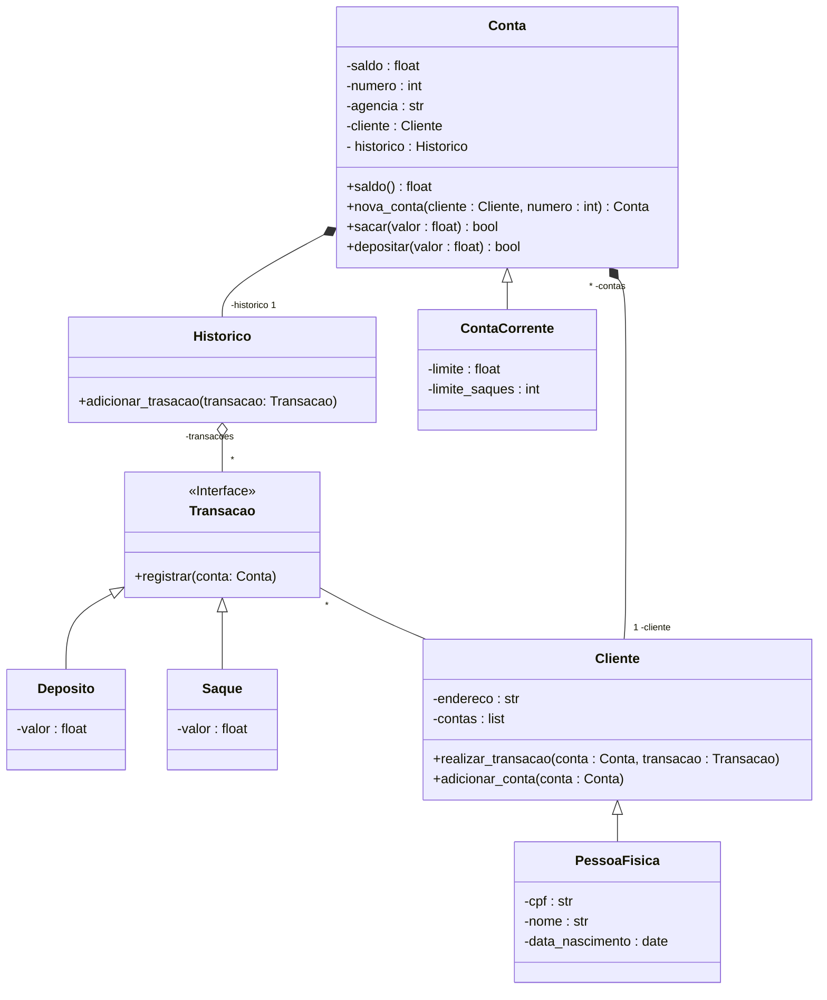

<h1>
    DESAFIO DIO - Bootcamp Python AI Backend Developer
</h1>

## Objetivo
Repositório criado para concluir o desafio proposto pela  [DIO](https://www.dio.me/): **Modelando um Sistema Bancário com POO**

## Versões anteriores:

 
 

## O que há de novo?   

O novo sistema possui **classes** para cliente e operações bancárias. Dessa forma, **os dados dos clientes e das contas bancárias são armazenados em objetos ao invés de dicionários**.

## Requisitos - Diagrama de classes:

